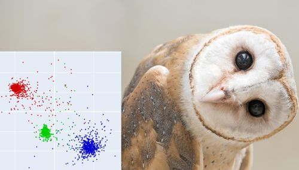

# Barn Owl Vocal Individuality (VI) Demo


This codebase explores patterns in large amounts of barn owl audio. We use spectrogram analysis and a zero-crossing algorithm to isolate individual owl chirps. Since the calls are naturally spaced—possibly due to a feeding negotiation tactic—it’s easy to segment them without overlap. The result is a large dataset of distinct chirps, which can be used for clustering and classification. The repo includes code for data loading, feature extraction, and visualisation to analyse vocalisation patterns. This project was featured in an AI for sustainability conference (CAIREES 2025). 
 
## Run it yourself
Please ensure that you have [Miniconda](https://www.anaconda.com/docs/getting-started/miniconda/install) and [git](https://git-scm.com/downloads) installed on your system before starting.

1. **Getting files**: Navigate to your working directory. Then:
    ```bash
    $ git clone https://github.com/jayathungek/owlnet.git
    $ cd owlnet
    ```
1. **Setting up directories:** Create a folder named `owl_data` in the root directory of the project (i.e. `owlnet`). This is where your audio files should go. The program looks for `*.wav` files in this directory to build its dataset. If you have a model checkpoint, put it in the `model_checkpoints` folder.
1. **Installing dependencies**
    ```bash
    $ conda env create -f environment.yml
    $ conda activate owlnet
    ```
1. **Running the Jupyter notebook**: 
    ```bash
    (owlnet)$ jupyter notebook
    ```
    This will open a browser window from which you can select the notebook you wish to run. If you just want to run the demo, this is `owlnet_demo.ipynb`. Run all the cells in order.

### Optional: Training from scratch 
If you would like to train your own model with different data or a modified architecture, please run `training.ipynb`

### Video card
Typically, a video card (NVIDA) is required for training and inference. However if this is not possible on your system, please change line 18 in `utils.py` as indicated in that file. This is very much NOT recommended -- the demo will take ages to run and even longer to train. Please note: 

## Get the data and model checkpoint
1. You can find the pretrained model checkpoint here: [model_3584.datapoints_105.epochs.pth](https://drive.google.com/file/d/1hK8d2c_IYS1dbC6R4o8hvzeww6o08kmn/view?usp=sharing).

1. Please contact me [here](mailto:kjayathunge@bournemouth.ac.uk) to request access to the barn owl recordings. 